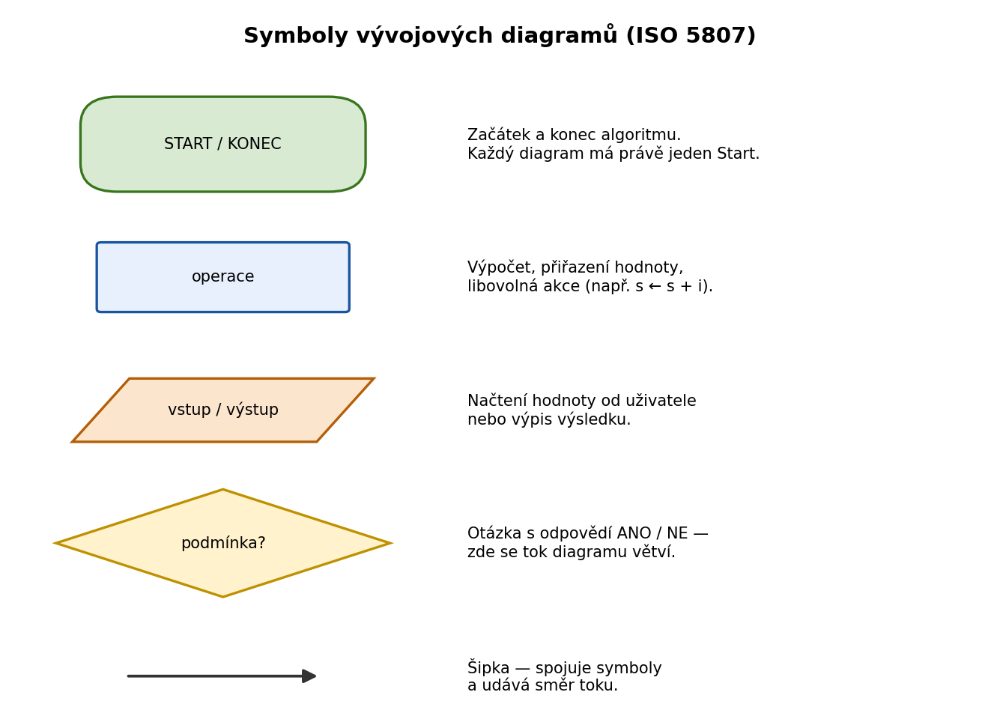
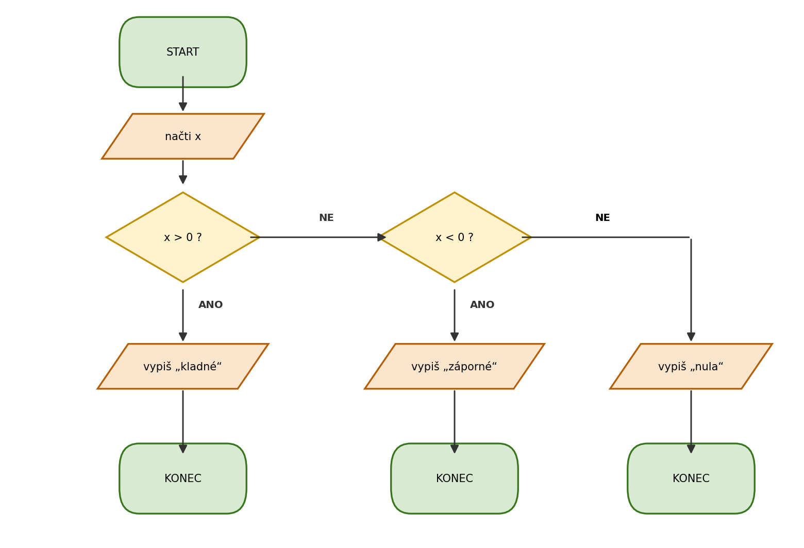
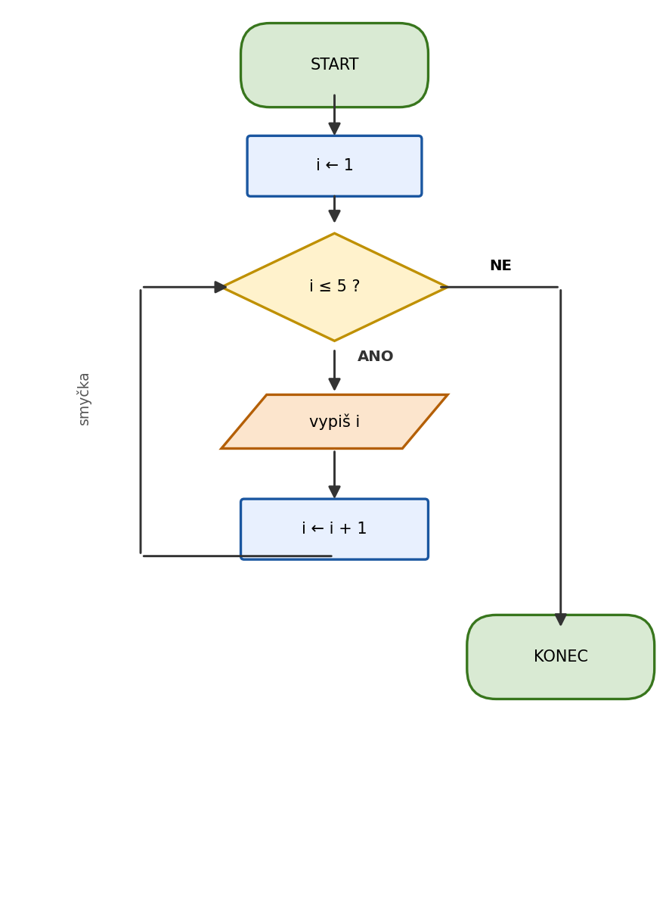
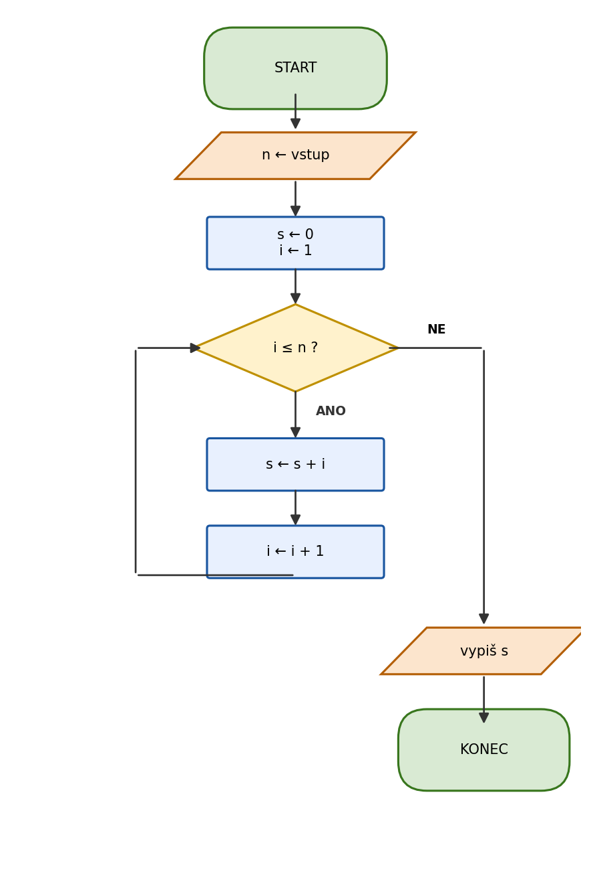

Vývojový diagram je grafický zápis algoritmu. Místo slov používá standardizované symboly propojené šipkami — díky tomu je struktura algoritmu okamžitě viditelná, bez ohledu na programovací jazyk.

---

## Proč vývojové diagramy?

Než začneš psát kód, je užitečné si algoritmus nakreslit. Vývojový diagram ti pomůže:

- **odhalit chyby v logice** dřív, než napíšeš jediný řádek kódu
- **vysvětlit algoritmus** kolegovi nebo zákazníkovi, který neprogramuje
- **rozmyslet větvení a cykly** — uvidíš, jestli program v každé situaci skončí správně

---

## Symboly

Každý symbol má přesně daný tvar a význam. Standardizuje je norma ISO 5807.

| Symbol | Tvar | Použití |
|---|---|---|
| Začátek / Konec | Ovál (zaoblený obdélník) | Každý diagram má právě jeden Start a jeden Konec (občas pro přehlednost píšeme více konců) |
| Operace | Obdélník | Výpočet, přiřazení hodnoty, libovolná akce |
| Vstup / Výstup | Rovnoběžník (šikmé strany) | Načtení hodnoty od uživatele nebo výpis výsledku |
| Podmínka | Kosočtverec | Otázka s odpovědí Ano / Ne — zde se diagram větví |
| Šipka | Čára se šipkou | Spojuje symboly, udává směr toku |

> 💡 V praxi se schémata často kreslí s obdélníkem i pro vstup/výstup — základní tvar postačí, dokud je jasné, co symbol znamená. Ve škole se ale drž standardního rozdělení.

---

## Pravidla pro kreslení

1. **Jeden vstup, jeden výstup** — každý symbol má jednu šipku dovnitř (výjimka: Start) a jednu ven (výjimka: podmínka má dvě)
2. **Podmínka vždy se dvěma větvemi** — Ano a Ne, obě musí někam vést
3. **Žádné volně visící šipky** — každá větev se buď napojí zpět, nebo dojde ke Konci
4. **Tok shora dolů** — kreslí se zpravidla shora dolů, zleva doprava

---

## Příklad: Rozhodnutí

Algoritmus, který zjistí, zda je číslo kladné, záporné nebo nula.

Postup čtení diagramu:

1. **Start**
2. Načti číslo `x` od uživatele
3. Je `x > 0`? → Ano: vypiš „kladné", konec. Ne: pokračuj
4. Je `x < 0`? → Ano: vypiš „záporné", konec. Ne: vypiš „nula", konec

Všimni si, že každá větev vede ke svému **Konci** — algoritmus skončí vždy, v každé situaci.

---

## Příklad: Cyklus

Cyklus se ve vývojovém diagramu pozná šipkou, která se **vrací zpět** na dřívější symbol.

Algoritmus, který vypisuje čísla 1 až 5:

Zpětná šipka (smyčka) je klíčový vizuální signál — říká: tenhle blok se bude opakovat.

> ⚠️ Pozor na **nekonečnou smyčku** — pokud podmínka nikdy nenastane jako Ne (např. zapomeneš `i = i + 1`), algoritmus nikdy neskončí. Vývojový diagram ti tento problém pomůže odhalit ještě před psaním kódu.

---

## Tipy pro kreslení

- Nástroje pro rychlé kreslení: [draw.io](https://draw.io) (zdarma, online), Excalidraw, nebo tužka a papír
- Začni vždy od **Startu** a postupuj krok za krokem — neptej se „jak to nakreslit", ale „co se stane jako první, druhé, třetí…"
- Pokud nevíš jak zakreslit složitou část, rozlož ji na menší kroky a kresli každý zvlášť

---

## Shrnutí

| Symbol | Tvar | Klíčová vlastnost |
|---|---|---|
| Start / Konec | Ovál | Vždy jeden Start, alespoň jeden Konec |
| Operace | Obdélník | Libovolná akce nebo výpočet |
| Vstup / Výstup | Rovnoběžník | Komunikace s uživatelem |
| Podmínka | Kosočtverec | Větví tok na Ano / Ne |
| Šipka | Čára | Určuje pořadí kroků |

---

## Otázky k zamyšlení

1. Proč má vývojový diagram různé tvary značek (obdélník, kosočtverec, rovnoběžník)? Co by se stalo, kdyby vše bylo v obdélnících?
2. Z kosočtverce (rozhodování) vedou vždy dvě šipky. Může jich vést víc? A může vést jen jedna?
3. Kdy je vhodnější vývojový diagram a kdy slovní popis (pseudokód)?

---

## Procvičení

### Řešený příklad

**Zadání:** Na obrázku je vývojový diagram. Vytrasujte ho pro vstup `n = 4` — do tabulky si zapisujte hodnoty proměnných `i` a `s` po každém průchodu — a určete, co algoritmus počítá a co vypíše.

💡 Zobrazit řešení

Trasovací tabulka pro `n = 4`:

| krok | i | s | podmínka i ≤ n |
|------|---|---|----------------|
| start | 1 | 0 | 1 ≤ 4 → ANO |
| 1. průchod | 2 | 1 | 2 ≤ 4 → ANO |
| 2. průchod | 3 | 3 | 3 ≤ 4 → ANO |
| 3. průchod | 4 | 6 | 4 ≤ 4 → ANO |
| 4. průchod | 5 | 10 | 5 ≤ 4 → NE |

Algoritmus sčítá čísla od 1 do n — vypíše **10** (protože 1+2+3+4 = 10).

### Samostatná cvičení

1. **Základní** — Nakreslete vývojový diagram algoritmu, který načte číslo a vypíše, zda je kladné, záporné, nebo nula.
2. **Pokročilejší** — Nakreslete vývojový diagram algoritmu, který načítá čísla tak dlouho, dokud uživatel nezadá nulu, a pak vypíše jejich součet.
3. **Bonus (*)** — Upravte diagram z řešeného příkladu tak, aby počítal faktoriál čísla n. Které značky se změní a které zůstanou?