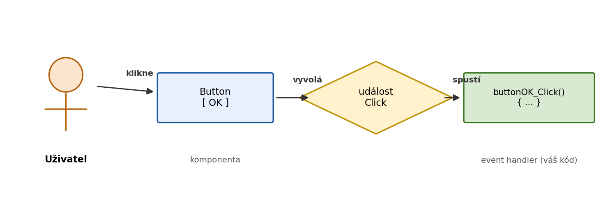

WinForms aplikace nefunguje jako konzolový program — nespouští příkazy shora dolů, ale **čeká na akce uživatele**. Kliknutí na tlačítko, změna textu, stisk klávesy — to vše jsou **události** (events), na které program reaguje.

---

## Jak události fungují

Každá komponenta (Button, TextBox, Form…) má sadu událostí, které může vyvolat. Když uživatel provede akci, komponenta „vyvolá" příslušnou událost — a pokud je k ní připojená obslužná metoda, ta se spustí.



Obslužná metoda se nazývá **event handler**.

---

## Nejčastější události

| Událost | Komponenta | Kdy se spustí |
|---|---|---|
| `Click` | Button, Label, PictureBox | Kliknutí levým tlačítkem myši |
| `TextChanged` | TextBox, ComboBox | Při každé změně textu |
| `Load` | Form | Při načtení formuláře (před zobrazením) |
| `FormClosing` | Form | Těsně před zavřením okna |
| `KeyDown` | Form, TextBox | Stisk klávesy |
| `KeyPress` | TextBox | Stisk klávesy produkující znak |
| `SelectedIndexChanged` | ComboBox, ListBox | Změna vybrané položky |
| `CheckedChanged` | CheckBox, RadioButton | Změna zaškrtnutí |
| `ValueChanged` | NumericUpDown, TrackBar | Změna hodnoty |

---

## Vytvoření event handleru

### Způsob 1 — dvojklik v Designeru (nejrychlejší)

Dvojklikem na komponentu v Designeru Visual Studio automaticky:
1. Vytvoří metodu event handleru
2. Připojí ji k výchozí události komponenty (pro Button je výchozí `Click`)
3. Přesune kurzor do těla metody

```csharp
private void buttonOK_Click(object sender, EventArgs e)
{
    // sem píšeš kód
}
```

### Způsob 2 — přes panel Properties

1. Vyber komponentu v Designeru
2. V panelu Properties klikni na ikonu blesku ⚡ (Events)
3. Najdi požadovanou událost a dvojklikni na prázdné pole vedle ní

Tento způsob použij, když potřebuješ jiný event než výchozí (např. `MouseEnter`, `KeyDown`).

---

## Signatura event handleru

Všechny event handlery ve WinForms mají stejnou strukturu:

```csharp
private void názevKomponenty_NázevUdálosti(object sender, EventArgs e)
{
    // kód
}
```

- `object sender` — komponenta, která událost vyvolala (lze přetypovat na konkrétní typ)
- `EventArgs e` — informace o události (u některých události obsahuje užitečná data)

Pojmenování `buttonOK_Click` je konvence Visual Studia — název lze změnit, ale nepomíchej ho s napojením v Designeru.

---

## Příklad: Tlačítko s reakcí

```csharp
private void buttonGreet_Click(object sender, EventArgs e)
{
    string name = textBoxName.Text;

    if (string.IsNullOrWhiteSpace(name))
    {
        labelResult.Text = "Zadej prosím jméno.";
        return;
    }

    labelResult.Text = $"Ahoj, {name}!";
}
```

---

## Parametr `sender`

`sender` je odkaz na komponentu, která událost spustila. Hodí se, když **jeden handler obsluhuje více komponent**:

```csharp
private void buttonColor_Click(object sender, EventArgs e)
{
    Button btn = (Button)sender;        // přetypování na Button
    this.BackColor = btn.BackColor;     // nastav barvu okna podle barvy tlačítka
}
```

Tento handler lze připojit k více tlačítkům — každé nastaví jinou barvu, protože přes `sender` víme, které bylo stisknuto.

---

## Událost Load

`Form.Load` se spustí jednou při načtení formuláře — ještě před tím, než ho uživatel uvidí. Používá se pro inicializaci:

```csharp
private void Form1_Load(object sender, EventArgs e)
{
    comboBoxMonth.Items.AddRange(new string[]
    {
        "Leden", "Únor", "Březen", "Duben", "Květen", "Červen",
        "Červenec", "Srpen", "Září", "Říjen", "Listopad", "Prosinec"
    });
    comboBoxMonth.SelectedIndex = 0;
}
```

---

## Shrnutí

| Pojem | Vysvětlení |
|---|---|
| Událost (event) | Akce uživatele nebo systému (kliknutí, změna textu…) |
| Event handler | Metoda, která se spustí jako reakce na událost |
| `sender` | Komponenta, která událost vyvolala |
| `EventArgs e` | Doplňující informace o události |
| Designer / Properties | Vizuální způsob napojení handleru na událost |