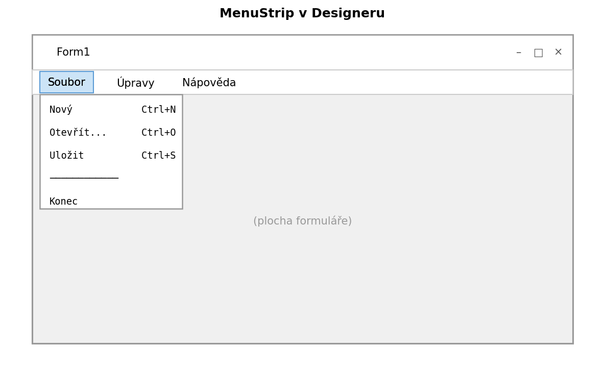
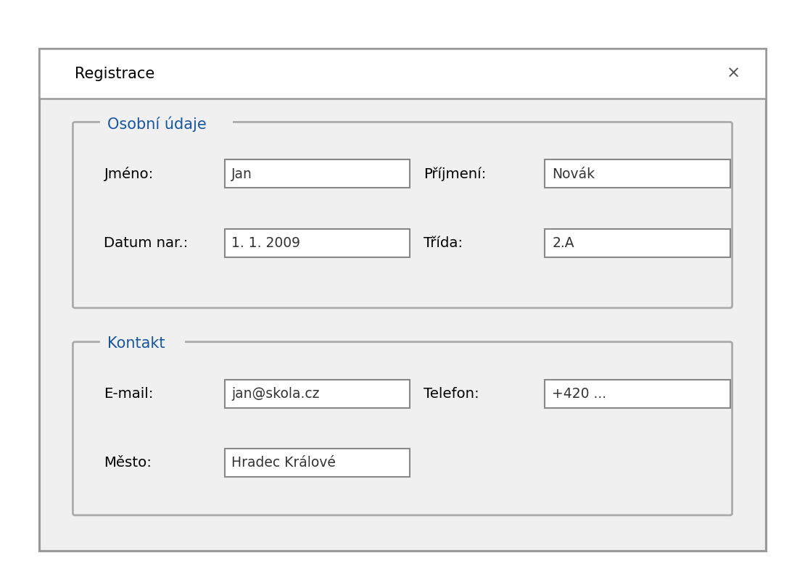

Předchozí kapitola pokryla základní komponenty pro vstup a výstup dat. Tato kapitola rozšiřuje paletu o komponenty pro strukturování aplikace, navigaci a zobrazení komplexnějších dat.

---

## MenuStrip — hlavní nabídka

`MenuStrip` přidá do okna standardní lištu s nabídkami (Soubor, Úpravy, Nápověda…).

**Přidání v Designeru:** přetáhni `MenuStrip` z Toolboxu na formulář — ukotví se automaticky nahoře. Klikáním přímo do lišty přidáváš položky nabídky.



Obsluha kliknutí na položku menu:

```csharp
private void novyToolStripMenuItem_Click(object sender, EventArgs e)
{
    // akce pro Soubor → Nový
    textBoxObsah.Clear();
}

private void ukoncitToolStripMenuItem_Click(object sender, EventArgs e)
{
    Application.Exit();
}
```

### StatusStrip a ToolStrip

`StatusStrip` je lišta ve spodní části okna pro stavové informace (počet záznamů, aktuální stav…).

`ToolStrip` je lišta s ikonami pod MenuStripem — rychlý přístup k nejčastějším akcím.

```csharp
// Aktualizace stavové lišty
toolStripStatusLabel1.Text = $"Načteno {pocet} záznamů";
```

---

## Panel a GroupBox — organizace obsahu

`Panel` je neviditelný kontejner — seskupuje komponenty a umožňuje je zobrazovat/skrývat najednou.

`GroupBox` je viditelný rámeček s nadpisem, vizuálně odděluje skupinu příbuzných prvků.

```csharp
// Zobrazit/skrýt celou sekci najednou
panelPrihlaseni.Visible = false;
panelHlavni.Visible = true;
```



---

## TabControl — záložkové rozhraní

`TabControl` rozděluje obsah do záložek — vhodné pro formuláře s mnoha sekci.

**Přidání záložek:** v Properties klikni na `TabPages` → `...` → přidávej stránky.

Každá záložka (`TabPage`) je samostatný kontejner — vkládáš do ní komponenty jako do formuláře.

```csharp
// Přepnout na konkrétní záložku
tabControl1.SelectedIndex = 1;

// Zjistit aktuální záložku
if (tabControl1.SelectedTab.Text == "Kontakt")
{
    // ...
}
```

---

## Timer — opakované akce

`Timer` je neviditelná komponenta, která v pravidelných intervalech vyvolává událost `Tick`. Neblokuje uživatelské rozhraní.

| Vlastnost | Popis |
|---|---|
| `Interval` | Čas mezi tiky v milisekundách (1000 = 1 sekunda) |
| `Enabled` | `true` = timer běží, `false` = zastaven |

```csharp
// Nastavení v kódu (nebo v Designeru přes Properties)
timer1.Interval = 1000;
timer1.Start();

private void timer1_Tick(object sender, EventArgs e)
{
    labelCas.Text = DateTime.Now.ToString("HH:mm:ss");
}
```

> 💡 `timer1.Start()` je totéž jako `timer1.Enabled = true`. Pro zastavení: `timer1.Stop()`.

---

## DataGridView — tabulková data

`DataGridView` zobrazuje data v tabulce s řádky a sloupci — podobně jako Excel.

### Ruční plnění dat

```csharp
// Definice sloupců
dataGridView1.Columns.Add("Jmeno", "Jméno");
dataGridView1.Columns.Add("Vek", "Věk");
dataGridView1.Columns.Add("Mesto", "Město");

// Přidání řádků
dataGridView1.Rows.Add("Jana Nováková", 28, "Praha");
dataGridView1.Rows.Add("Tomáš Dvořák", 34, "Brno");
dataGridView1.Rows.Add("Eva Horáková", 22, "Ostrava");
```

### Napojení na seznam objektů

Nejpohodlnější způsob — přiřaď `List<T>` jako zdroj dat:

```csharp
List<Zamestnanec> seznam = NactiZamestnance();
dataGridView1.DataSource = seznam;
```

DataGridView automaticky vytvoří sloupec pro každou veřejnou property třídy `Zamestnanec`.

### Čtení vybraného řádku

```csharp
private void dataGridView1_CellClick(object sender, DataGridViewCellEventArgs e)
{
    if (e.RowIndex < 0) return;  // klik na záhlaví

    string jmeno = dataGridView1.Rows[e.RowIndex].Cells["Jmeno"].Value.ToString();
    labelVybrano.Text = $"Vybráno: {jmeno}";
}
```

---

## Shrnutí

| Komponenta | Použití |
|---|---|
| `MenuStrip` | Hlavní nabídka (Soubor, Úpravy…) |
| `StatusStrip` | Stavová lišta ve spodní části okna |
| `ToolStrip` | Lišta s ikonami pro rychlé akce |
| `Panel` | Neviditelný kontejner pro seskupení komponent |
| `GroupBox` | Viditelný rámeček s nadpisem |
| `TabControl` | Záložkové rozhraní |
| `Timer` | Opakované akce v pravidelných intervalech |
| `DataGridView` | Zobrazení tabulkových dat |