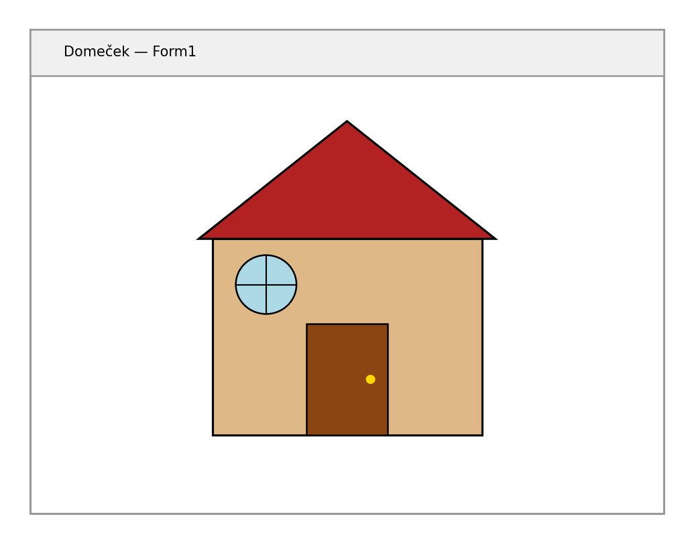

Tato kapitola navazuje na přehled z kapitoly 31. Naučíš se kreslit základní tvary, pracovat s barvami a textem a správně obsluhovat událost `Paint`.

---

## Pen a Brush

Pro kreslení potřebuješ dva nástroje:

| Nástroj | Třída | Použití |
|---|---|---|
| Pero | `Pen` | Obrysy čar a tvarů |
| Štětec | `Brush` | Výplně ploch |

```csharp
// Hotová pera z třídy Pens (nepotřebuješ Dispose)
Pens.Black
Pens.Red

// Vlastní pero — barva a tloušťka
using Pen pero = new Pen(Color.Blue, 3);

// Štětce — plné barvy
using SolidBrush stetec = new SolidBrush(Color.LightYellow);
```

> 💡 Vlastní `Pen` a `Brush` jsou `IDisposable` — použi `using`, aby se automaticky uvolnily po použití.

---

## Kreslicí metody

Všechny metody volíš na objektu `Graphics`. Metody s `Draw` kreslí obrys, s `Fill` kreslí vyplněný tvar.

### Čára

```csharp
g.DrawLine(Pens.Black, 10, 10, 200, 100);
// parametry: pero, x1, y1, x2, y2
```

### Obdélník

```csharp
g.DrawRectangle(Pens.Black, 50, 50, 150, 80);
g.FillRectangle(Brushes.LightBlue, 50, 50, 150, 80);
// parametry: pero/štětec, x, y, šířka, výška
```

### Elipsa (a kruh)

```csharp
g.DrawEllipse(Pens.Red, 100, 100, 120, 80);  // elipsa
g.FillEllipse(Brushes.Yellow, 200, 50, 60, 60);  // kruh (stejná šířka i výška)
// parametry: pero/štětec, x, y, šířka, výška — ohraničující obdélník
```

### Mnohoúhelník

```csharp
Point[] body = {
    new Point(150, 20),
    new Point(250, 80),
    new Point(200, 160),
    new Point(100, 160),
    new Point(50, 80)
};
g.DrawPolygon(Pens.DarkGreen, body);
g.FillPolygon(Brushes.LightGreen, body);
```

---

## Text

```csharp
using Font font = new Font("Arial", 14, FontStyle.Bold);
using SolidBrush stetec = new SolidBrush(Color.DarkBlue);

g.DrawString("Ahoj světe!", font, stetec, 50, 30);
// parametry: text, font, štětec, x, y
```

---

## Událost Paint — kompletní příklad

```csharp
private void Form1_Paint(object sender, PaintEventArgs e)
{
    Graphics g = e.Graphics;

    // Pozadí
    g.FillRectangle(Brushes.White, this.ClientRectangle);

    // Domeček
    g.FillRectangle(Brushes.SandyBrown, 100, 150, 200, 150);    // stěny
    g.DrawRectangle(Pens.Black, 100, 150, 200, 150);

    Point[] strecha = {
        new Point(80, 150),
        new Point(200, 60),
        new Point(320, 150)
    };
    g.FillPolygon(Brushes.Firebrick, strecha);   // střecha
    g.DrawPolygon(Pens.Black, strecha);

    g.FillRectangle(Brushes.SkyBlue, 170, 170, 60, 50);  // okno
    g.DrawRectangle(Pens.Black, 170, 170, 60, 50);

    g.FillRectangle(Brushes.SaddleBrown, 175, 240, 50, 60);  // dveře
}
```



---

## Práce s obrázky

```csharp
// Načtení obrázku ze souboru
Image obrazek = Image.FromFile("logo.png");
g.DrawImage(obrazek, 10, 10);                        // původní velikost
g.DrawImage(obrazek, new Rectangle(10, 10, 100, 80)); // přizpůsobená velikost
```

Pro opakované použití obrázku ho načti jednou (např. v `Form_Load`) do proměnné třídy — nevoláš `Image.FromFile` při každém překreslení.

---

## Shrnutí

| Metoda | Co kreslí |
|---|---|
| `DrawLine` | Čára |
| `DrawRectangle` / `FillRectangle` | Obdélník (obrys / výplň) |
| `DrawEllipse` / `FillEllipse` | Elipsa / kruh |
| `DrawPolygon` / `FillPolygon` | Mnohoúhelník |
| `DrawString` | Text |
| `DrawImage` | Obrázek |