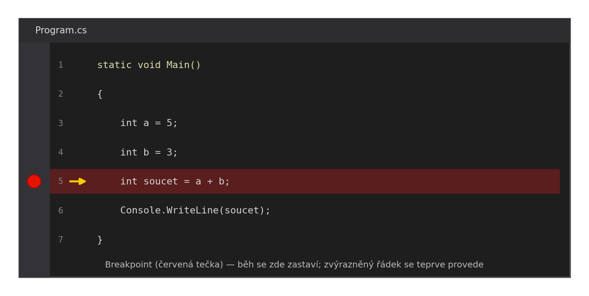
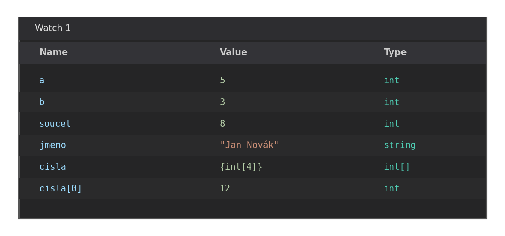

Ladění (debugging) je proces hledání a opravování chyb v programu. Visual Studio nabízí výkonné nástroje, které ti umožní program zastavit, zkontrolovat hodnoty proměnných a projít kód krok za krokem.

---

## Breakpoint — bod přerušení

Breakpoint je značka na řádku kódu, která říká debuggeru: „tady zastav." Program běží normálně, dokud na breakpoint nenarazí — pak se pozastaví a předá kontrolu tobě.

**Přidání breakpointu:** klikni do šedého pruhu vlevo od čísla řádku, nebo stiskni `F9` na daném řádku. Řádek se zvýrazní červeně.



Spusť program v debug módu tlačítkem ▶ nebo klávesou `F5`. Jakmile program dosáhne breakpointu, pozastaví se a šipka ukáže, který řádek bude proveden jako další.

---

## Krokování

Když je program pozastaven, máš tři možnosti jak pokračovat:

| Akce | Klávesa | Co udělá |
|---|---|---|
| **Step Over** | `F10` | Provede aktuální řádek, zastaví na dalším — do volané metody nevstoupí |
| **Step Into** | `F11` | Vstoupí dovnitř volané metody |
| **Step Out** | `Shift+F11` | Doběhne do konce aktuální metody a zastaví za jejím voláním |
| **Continue** | `F5` | Pokračuje v běhu až k dalšímu breakpointu |

> 💡 `Step Over` používej pro přeskočení metod, jejichž vnitřek tě nezajímá. `Step Into` pro vstup do konkrétní metody, kterou chceš zkontrolovat.

---

## Watch okno — sledování proměnných

Při pozastaveném programu vidíš aktuální hodnoty proměnných několika způsoby:

**Hover** — najeď myší na název proměnné v kódu. Zobrazí se tooltip s její aktuální hodnotou.

**Locals** (`Debug → Windows → Locals`) — automaticky zobrazuje všechny lokální proměnné aktuálního scope.

**Watch** (`Debug → Windows → Watch`) — přidáš konkrétní výrazy, které chceš sledovat průběžně.



---

## Immediate Window

`Debug → Windows → Immediate` (nebo `Ctrl+Alt+I`) — spustitelný příkazový řádek za běhu programu. Můžeš vyhodnocovat výrazy a volat metody:

```
? seznam.Count
> 5
? Math.Sqrt(16)
> 4.0
? jmeno.ToUpper()
> "TOMÁŠ"
```

Hodí se pro rychlé otestování výrazu bez nutnosti upravovat kód.

---

## Podmíněný breakpoint

Normální breakpoint zastaví program pokaždé. Podmíněný breakpoint zastaví jen tehdy, kdy platí podmínka — neocenitelné při ladění cyklů:

Pravý klik na breakpoint → **Conditions** → zadej podmínku, např. `i == 47`.

Program projde 46 iterací bez zastavení a zastaví se přesně tam, kde potřebuješ.

---

## Časté logické chyby

| Symptom | Pravděpodobná příčina |
|---|---|
| Cyklus se neprovede ani jednou | Podmínka je `false` hned od začátku |
| Cyklus je nekonečný | Proměnná cyklu se nemění |
| Off-by-one (`< n` vs `<= n`) | Špatná hranice podmínky |
| Nesprávný výsledek výpočtu | Špatné pořadí operací, celočíselné dělení místo desetinného |
| `NullReferenceException` | Proměnná nikdy nebyla inicializována |

---

## Shrnutí

| Nástroj | Účel |
|---|---|
| Breakpoint (`F9`) | Zastaví program na daném řádku |
| Step Over (`F10`) | Provede řádek, nevstoupí do metody |
| Step Into (`F11`) | Vstoupí dovnitř volané metody |
| Locals / Watch | Zobrazí hodnoty proměnných |
| Immediate Window | Spustí výraz za běhu |
| Podmíněný breakpoint | Zastaví jen při splnění podmínky |
