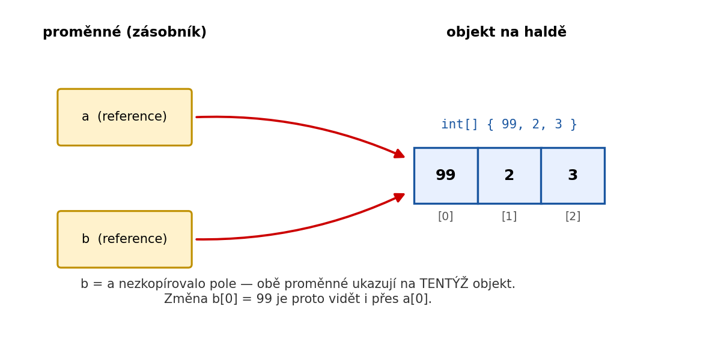

Každý typ v C# je buď **hodnotový** nebo **referenční**. Tento rozdíl určuje, co se stane při kopírování proměnné nebo předání do metody.

---

## Hodnotové typy

Hodnotový typ uchovává **přímo hodnotu**. Při přiřazení vznikne nezávislá kopie.

```csharp
int a = 10;
int b = a;   // b je kopie hodnoty 10
b = 99;

Console.WriteLine(a);  // 10 — nezměněno
Console.WriteLine(b);  // 99
```

**Hodnotové typy:** `int`, `long`, `double`, `float`, `decimal`, `bool`, `char`, `byte`, `struct`, `enum`

---

## Referenční typy

Referenční typ uchovává **odkaz** (adresu) na objekt v paměti. Při přiřazení se zkopíruje odkaz — ne data.

```csharp
int[] a = { 1, 2, 3 };
int[] b = a;   // b odkazuje na stejné pole jako a

b[0] = 99;

Console.WriteLine(a[0]);  // 99 — změnil se objekt, na který odkazují oba
Console.WriteLine(b[0]);  // 99
```



**Referenční typy:** třídy (všechny vlastní třídy), `string`, pole (`int[]`, `string[]`…), rozhraní

---

## Kopírování objektu (deep copy)

Pokud chceš skutečnou nezávislou kopii objektu, musíš ji vytvořit ručně:

```csharp
int[] original = { 1, 2, 3 };

// Mělká kopie — stále referenční problém u polí objektů
int[] kopie = (int[])original.Clone();

// Nebo:
int[] kopie2 = new int[original.Length];
Array.Copy(original, kopie2, original.Length);

kopie[0] = 99;
Console.WriteLine(original[0]);  // 1 — nezměněno
```

---

## Předávání do metod

### Hodnotový typ — předání hodnotou

```csharp
void Zdvoj(int x)
{
    x = x * 2;
    Console.WriteLine($"Uvnitř metody: {x}");  // 20
}

int cislo = 10;
Zdvoj(cislo);
Console.WriteLine($"Vně metody: {cislo}");  // 10 — nezměněno
```

Metoda dostane **kopii** hodnoty. Změna uvnitř metody nemá vliv na původní proměnnou.

### Referenční typ — předání odkazu

```csharp
void Nastav(int[] pole)
{
    pole[0] = 99;
}

int[] data = { 1, 2, 3 };
Nastav(data);
Console.WriteLine(data[0]);  // 99 — změna se projevila
```

Metoda dostane **kopii odkazu** — ale oba odkazy míří na stejný objekt. Změna obsahu objektu je viditelná i vně.

### Klíčové slovo `ref` a `out`

Pokud chceš předat hodnotový typ odkazem (aby metoda mohla změnit původní proměnnou):

```csharp
void Zdvoj(ref int x)
{
    x = x * 2;
}

int cislo = 10;
Zdvoj(ref cislo);
Console.WriteLine(cislo);  // 20 — změněno
```

`out` funguje podobně, ale proměnná nemusí být inicializována před předáním — metoda ji musí nastavit.

---

## Výjimka: `string`

`string` je referenční typ, ale chová se jako hodnotový — je **immutable** (neměnný). Každá operace na stringu vytvoří nový objekt.

```csharp
string a = "ahoj";
string b = a;
b = b.ToUpper();

Console.WriteLine(a);  // ahoj — nezměněno
Console.WriteLine(b);  // AHOJ
```

`b.ToUpper()` nevytvořil nový string v `b` — ale `b` nyní odkazuje na nový objekt `"AHOJ"`, zatímco `a` stále odkazuje na původní `"ahoj"`.

---

## Shrnutí

| | Hodnotový typ | Referenční typ |
|---|---|---|
| Ukládá | Přímo hodnotu | Odkaz na objekt |
| Kopírování | Nová nezávislá hodnota | Nový odkaz na stejný objekt |
| Předání do metody | Metoda dostane kopii | Metoda může měnit původní objekt |
| Příklady | `int`, `bool`, `struct` | třídy, pole, `string` |
