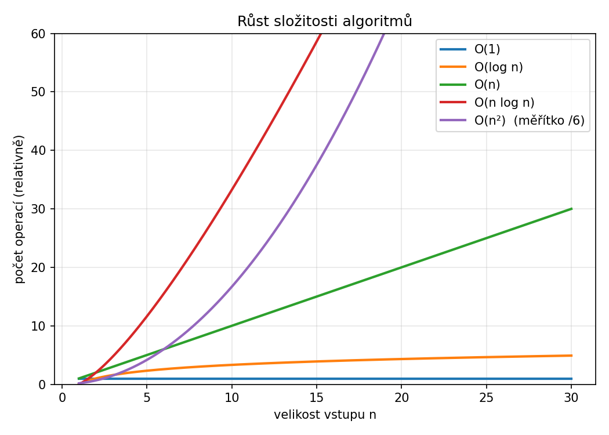

Dva algoritmy mohou řešit stejný problém — ale jeden zvládne milion prvků za sekundu a druhý za hodinu. Složitost algoritmů je způsob, jak tento rozdíl popsat bez nutnosti spouštět kód.

---

## Proč na tom záleží

```csharp
// Algoritmus A — hledání v neseřazeném poli
for (int i = 0; i < pole.Length; i++)
{
    if (pole[i] == hledany) return i;
}

// Algoritmus B — hledání v seřazeném poli (binární vyhledávání)
int levo = 0, pravo = pole.Length - 1;
while (levo <= pravo)
{
    int stred = (levo + pravo) / 2;
    if (pole[stred] == hledany) return stred;
    if (pole[stred] < hledany) levo = stred + 1;
    else pravo = stred - 1;
}
```

Pro 1 000 prvků: algoritmus A projde až 1 000 prvků. Algoritmus B projde maximálně 10 kroků. Pro milion prvků: A až 1 000 000 kroků, B maximálně 20.

---

## Asymptotická notace O(n)

O-notace popisuje, jak roste počet operací v závislosti na velikosti vstupu `n` — v nejhorším případě, pro velká `n`.

### O(1) — konstantní

Počet operací nezávisí na velikosti vstupu.

```csharp
int prvni = pole[0];  // vždy jeden přístup, bez ohledu na délku pole
```

### O(n) — lineární

Počet operací roste lineárně s velikostí vstupu.

```csharp
int soucet = 0;
foreach (int x in pole)  // projde každý prvek jednou
    soucet += x;
```

### O(n²) — kvadratická

Cyklus v cyklu — každý prvek se porovná s každým.

```csharp
for (int i = 0; i < pole.Length; i++)
    for (int j = 0; j < pole.Length; j++)
        // n × n operací
```

### O(log n) — logaritmická

Každým krokem se vstup zhruba půlí — binární vyhledávání, výše uvedený algoritmus B.

```csharp
// Pro n = 1 000 000 stačí asi 20 kroků
// Pro n = 1 000 000 000 stačí asi 30 kroků
```

---

## Porovnání složitostí

| Složitost | Název | n = 10 | n = 100 | n = 1 000 | n = 1 000 000 |
|---|---|---|---|---|---|
| O(1) | Konstantní | 1 | 1 | 1 | 1 |
| O(log n) | Logaritmická | 3 | 7 | 10 | 20 |
| O(n) | Lineární | 10 | 100 | 1 000 | 1 000 000 |
| O(n log n) | Linearitmická | 30 | 700 | 10 000 | 20 000 000 |
| O(n²) | Kvadratická | 100 | 10 000 | 1 000 000 | 10¹² |



> 💡 O-notace ignoruje konstanty a nižší členy — `O(2n)` se zapíše jako `O(n)`, `O(n² + n)` jako `O(n²)`. Zajímá nás chování pro velká `n`.

---

## Jak odhadnout složitost vlastního kódu

- **Jeden cyklus** přes `n` prvků → O(n)
- **Cyklus v cyklu** (oba přes `n`) → O(n²)
- **Každý krok půlí vstup** → O(log n)
- **Cyklus přes `n`, uvnitř O(log n) operace** → O(n log n)
- **Žádný cyklus, přímý přístup** → O(1)

---

## Paměťová složitost

Kromě časové složitosti existuje i **paměťová** — kolik paměti algoritmus spotřebuje navíc (mimo vstupní data).

```csharp
// O(1) paměťová složitost — jen pár proměnných
int max = pole[0];
foreach (int x in pole)
    if (x > max) max = x;

// O(n) paměťová složitost — nová kopie pole
int[] kopie = new int[pole.Length];
Array.Copy(pole, kopie, pole.Length);
```

---

## Shrnutí

| Notace | Název | Příklad |
|---|---|---|
| O(1) | Konstantní | Přístup k prvku pole přes index |
| O(log n) | Logaritmická | Binární vyhledávání |
| O(n) | Lineární | Průchod polem |
| O(n log n) | Linearitmická | Efektivní řazení (QuickSort, MergeSort) |
| O(n²) | Kvadratická | Bubble sort, porovnání každého s každým |
