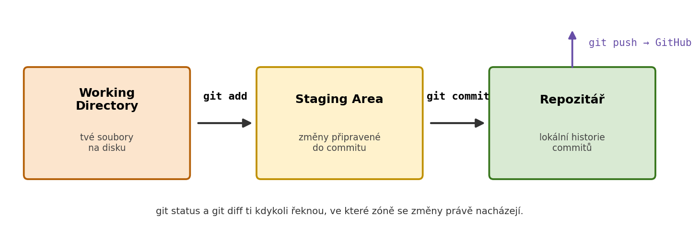
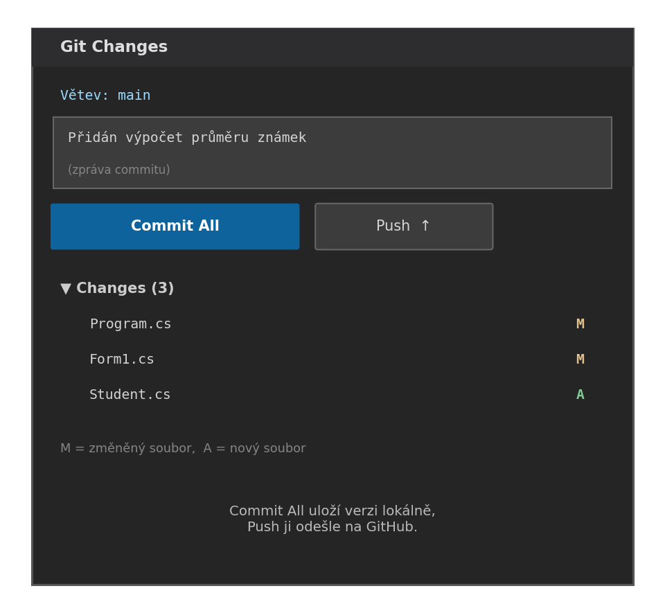

Verzovací systém sleduje změny v kódu — kdo co změnil, kdy a proč. Umožňuje vrátit se k libovolné dřívější verzi, pracovat na víc věcech naráz a spolupracovat v týmu bez přepisování elkaždé práce.

---

## Proč verzovat

Bez verzování:

- přepíšeš funkční kód a nemůžeš se vrátit
- pracuješ ve dvou lidech na stejném souboru a jeden přepíše druhého
- zálohy jsou složky `projekt_final`, `projekt_final2`, `projekt_final_FINAL`

S Gitem:

- každá změna je zaznamenána s popisem
- můžeš se vrátit k libovolnému stavu
- větve umožňují pracovat na nové funkci bez ovlivnění hlavního kódu

---

## Typy verzovacích systémů

| Typ | Popis | Příklad |
|---|---|---|
| Lokální | Historie jen na jednom počítači | RCS |
| Centralizovaný | Jeden sdílený server | SVN, TFS |
| Distribuovaný | Každý má plnou kopii repozitáře | **Git**, Mercurial |

Git je dnes průmyslový standard — distribuovaný, rychlý, offline schopný.

---

## Základní pojmy

| Pojem | Vysvětlení |
|---|---|
| **Repozitář (repo)** | Složka projektu sledovaná Gitem (obsahuje skrytou složku `.git`) |
| **Commit** | Snímek stavu projektu v daném čase s popisem změny |
| **Branch (větev)** | Nezávislá linie vývoje |
| **Remote** | Vzdálená kopie repozitáře (GitHub, GitLab) |
| **Clone** | Stažení celého repozitáře ze vzdáleného serveru |

---

## Základní příkazy

### Inicializace a konfigurace

```bash
# Nastavení identity (jednou pro celý počítač)
git config --global user.name "Jana Nováková"
git config --global user.email "jana@example.com"

# Vytvoření nového repozitáře ve stávající složce
git init
```

### Workflow: přidání a commitování změn

```bash
# Zjistit stav — které soubory jsou změněny
git status

# Přidat soubory do staging area (připravit k commitu)
git add soubor.cs          # konkrétní soubor
git add .                  # všechny změněné soubory

# Vytvořit commit se zprávou
git commit -m "Přidána funkce výpočtu průměru"
```



### Prohlížení historie

```bash
git log                    # výpis commitů
git log --oneline          # zkrácený výpis
```

### Práce se vzdáleným repozitářem (GitHub)

```bash
# Stažení existujícího repozitáře
git clone https://github.com/uzivatel/projekt.git

# Propojení lokálního repo se vzdáleným
git remote add origin https://github.com/uzivatel/projekt.git

# Nahrání změn na GitHub
git push origin main

# Stažení změn ze vzdáleného repozitáře
git pull
```

---

## Větve (branches)

Větve umožňují pracovat na nové funkci izolovaně — hlavní větev (`main`) zůstává funkční.

```bash
# Vytvoření a přepnutí na novou větev
git checkout -b nova-funkce

# Přepnutí zpět na main
git checkout main

# Sloučení větve do main
git merge nova-funkce

# Výpis větví
git branch
```

---

## Git v Visual Studiu

Visual Studio má integrovanou podporu Gitu — nepotřebuješ příkazový řádek. Panel **Git Changes** (View → Git Changes) umožňuje commitovat, pushovat a procházet historii přímo z IDE.



---

## Doporučené postupy

- **Commituj často** s krátkými, popisnými zprávami: `"Opravena chyba v přihlašování"` > `"fix"`
- **Jeden commit = jedna logická změna** — nesmíchávej opravu chyby s přidáním funkce
- **Nikdy necommituj hesla a API klíče** — jednou v historii, navždy dostupné
- **Používej `.gitignore`** pro ignorování build výstupů (`bin/`, `obj/`, `*.user`)

---

## Shrnutí

| Příkaz | Co dělá |
|---|---|
| `git init` | Vytvoří nový repozitář |
| `git clone <url>` | Stáhne repozitář ze vzdáleného serveru |
| `git status` | Zobrazí stav pracovního adresáře |
| `git add .` | Přidá vše do staging area |
| `git commit -m "zpráva"` | Vytvoří commit |
| `git push` | Nahraje commity na remote |
| `git pull` | Stáhne a sloučí změny z remote |
| `git checkout -b větev` | Vytvoří a přepne na novou větev |
| `git merge větev` | Sloučí větev do aktuální |
